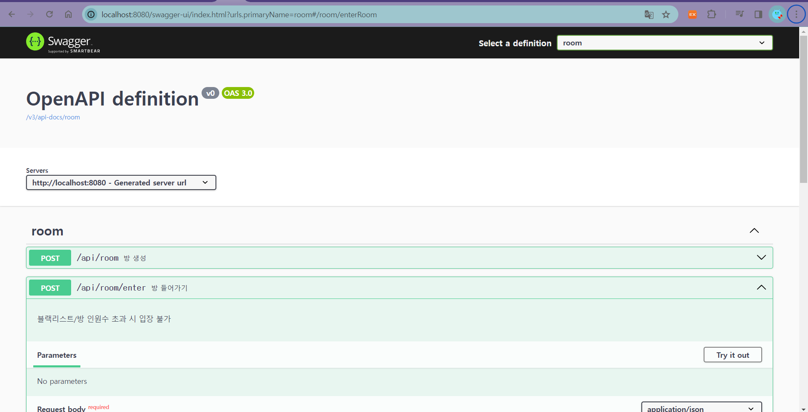

24-01-23
1. Gerrit 설정
2. Room branch 생성
3. Room 패키지 생성

24-01-24
1. Docker(Redis) - 스프링 부트 통신

24-01-25
1. API 명세서 보고 파라미터 수정
2. 방 나가기 시 현재 방 인원수를 줄이고 0이 되면 redis에서 삭제
3. RoomId를 RoomName Hash화 해서 생성
4. 방 조회 아이템/클래식으로 분리
5. 방 입장 시 Current Capacity 추가로 관리
6. 블랙리스트 추가

24-01-26
1. 방 입장, 삭제, 블랙리스트 입장 등 테스트
2. BE Merge

24-10-29
1. Swagger 적용

24-01-30
1. 랭크 시스템
2. Redis -> Front
3. DB -> Redis
4. 스케쥴러를 통해 30분마다 불러오기 실행
5. 현재 랭크가 없으면 리스트에 담지 못하게 함.

24-02-01
1. Friend Repository 추가
2. Friend Service 추가
3. Friend Controller 추가
4. Room 입장 roomId로 들어오도록 수정
5. 빠른 방 찾기 기능 item/classic로 나누기
6. 방 초대 기능 추가
24-01-31
1. 랭크 불러오지 못하는 버그 수정
2. Merge 후 버그 수정
3. 빠른 입장 기능 추가
4. Friend

